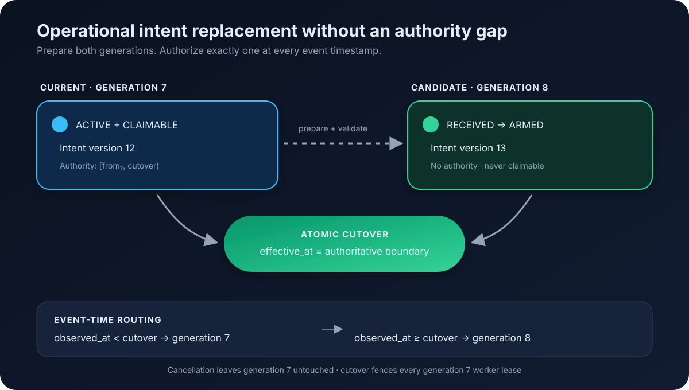

# Blue-Green Assignment Cutover

## Purpose

Operational-intent replacement is not an in-place geometry edit. Conformance
keeps an immutable current assignment while it prepares and arms a candidate,
then transfers authority at one explicit event-time boundary.



## Authority model

The API remains authoritative for local mission lifecycle and DSS coordination.
It delivers immutable assignment generations from its transactional outbox.
Conformance stores both generations, but only the current generation has an
authority interval and only current or ending generations are claimable.

The lifecycle is:

1. `PrepareAssignment` persists the candidate as `candidate_received`.
2. Validation and dependency checks finish before `ArmAssignment` marks it
   `candidate_armed`.
3. The current generation remains active throughout preparation and arming.
4. After the API durably commits the new local/DSS authority, it delivers an
   idempotent `CutoverAssignment` with the immutable `effective_at` boundary.
5. One PostgreSQL transaction changes the old generation to `superseded`, sets
   its exclusive `authority_until`, clears its lease, and activates the armed
   candidate with `authority_from = effective_at`.

Pending geometry never expands authorization. The evaluator must never union
the current and candidate volumes.

## Event-time routing

Authority intervals use half-open bounds:

```text
generation 7: [authority_from_7, cutover)
generation 8: [cutover, authority_until_8)
```

`ResolveAssignmentAt` selects the immutable generation for an observation's
capture time. A delayed frame received after cutover but captured before it is
therefore evaluated against generation 7. A frame captured exactly at cutover
belongs to generation 8.

PostgreSQL `timestamptz` is retained for readable audit timestamps, but it has
microsecond precision. Authority comparisons use companion signed Unix-
nanosecond columns so two telemetry frames around a sub-microsecond boundary
cannot be rounded onto the wrong generation.

## Failure behavior

- A preparation failure or `CancelCandidate` leaves the current generation and
  its lease untouched.
- A second, higher candidate supersedes only the older candidate.
- Cutover requires the highest candidate to be armed and uses the PostgreSQL
  clock to reject scheduled future authority changes.
- Reusing a source/message ID with identical content is idempotent; changed
  content is a conflict.
- Cutover clears the previous generation's lease. Its paused worker cannot
  renew or commit because both lifecycle and lease fences fail.
- Lower assignment generations are recorded as stale and cannot resurrect.
- The transition history and API outbox are written in the same transaction as
  every lifecycle change.

## Runtime contract still to add

The candidate-specific database names are also a rollback fence: the original
prototype binary only recognizes `received` and `armed`, so it cannot claim a
new candidate if a binary is accidentally rolled back.

The store contract and real-PostgreSQL tests implement this lifecycle. The
external Protobuf API and worker runtime remain a later slice. That contract
should carry assignment ID, assignment generation, exact intent ID/version,
stable message ID, and cutover `effective_at`. Reconciliation should compare the
API's current and pending generations with Conformance after ambiguous delivery.
