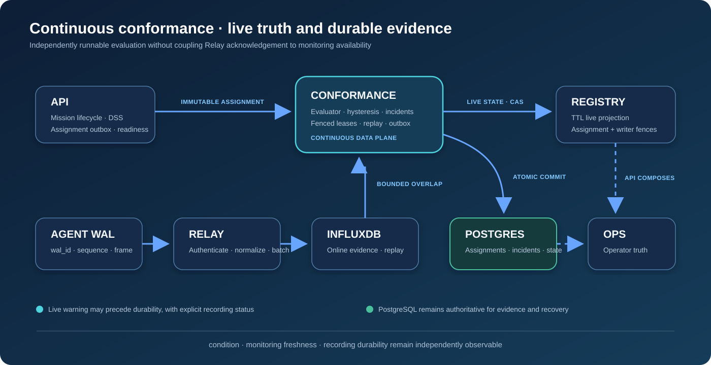

# Continuous Conformance Design

## Status

Initial architecture and bounded prototype. This document separates working
decisions from hypotheses that still require measurement.

## Objective

For every conformance-required active flight, continuously determine whether
the aircraft is within the exact authorized intent version and communicate a
safety-relevant change without waiting for the durable evidence transaction.
The system must recover deterministically after worker or dependency failure.

The operator model has three independent axes:

- **Condition:** conforming, suspected, non-conforming, recovering, or unknown.
- **Monitoring:** received, armed, current, stale, or unavailable.
- **Recording:** pending, confirmed, or degraded.

This avoids two dangerous simplifications: retaining an unqualified conforming
state while a detected breach waits for storage, and treating an ephemeral live
warning as if it were already durable evidence.

## Component ownership



The API emits an immutable assignment with aircraft, Agent, flight, intent and
intent version, assignment generation, volumes, policy, and effective window.
Conformance never selects a newer draft intent. Registry presence is diagnostic
context; it is not necessary for geometric containment.

Relay writes telemetry independently. Conformance cannot enter Relay's ACK path.

## Activation lifecycle

1. Preflight and deconfliction validate the submitted intent.
2. API coordinates DSS Accepted state and atomically inserts a Prepare Assignment
   event into its PostgreSQL outbox.
3. Conformance stores the assignment and returns `RECEIVED` idempotently.
4. A fenced worker validates the assignment and dependencies, then returns
   `ARMED`.
5. A conformance-required mission cannot activate before `ARMED`.
6. API coordinates DSS Activated state, commits local Active state, and emits
   Assignment Activated.
7. Conformance starts at `activated_at`, including backfill if delivery was late.
8. Cancellation or completion ends monitoring and schedules final reconciliation.

This is a saga, not a distributed transaction. Every stage must be idempotent,
observable, and reconcilable.

The API-to-Conformance assignment channel is mutually authenticated with TLS.
Conformance verifies the API client certificate against its configured client
CA before dispatching lifecycle RPCs; the command `source` only namespaces
idempotency and does not establish caller identity.

Replacement intents use the same lifecycle as a blue-green deployment. The
current generation stays authoritative and claimable while a higher generation
is received and armed. The API emits the cutover only after its local intent
version and DSS publication outcome are durably authoritative. Conformance then
closes the prior authority interval and activates the candidate in one database
transaction. See [Blue-green assignment cutover](assignment-cutover.md).

## Telemetry contract and cursor

The merged Relay table is `aircraft_telemetry`. `agent_id`, `frame_id`,
`message_name`, and `schema_version` are tags. Aircraft, flight, intent, Relay,
session, and `wal_sequence` are fields. Point `time` is Agent capture time.

The production contract needs a stable random `wal_id` created with the Agent's
SQLite WAL. The processing identity becomes:

```text
agent_id + wal_id + wal_sequence   ordering inside a WAL generation
frame_id                           idempotency across retry and reconnect
```

The forward-contract reader consumes only `global_position_int`. It refuses to
start live evaluation when `wal_id` is unavailable, so current Relay rows cannot
silently resemble an empty telemetry window. It queries bounded
half-open event-time windows for batches of aircraft, orders by event time and
WAL identity, and deduplicates stable frames. It intentionally rejects a query
that reaches its limit, because treating a truncated window as complete would
advance the checkpoint past unseen evidence.

WAL gaps do not mean missing position records: other MAVLink messages consume
sequences. WAL order also does not guarantee Influx visibility order. Concurrent
Relay writers, batching, and retry can expose a newer sequence first. Production
polling therefore needs overlap plus one of these deterministic semantics:

1. restore an evaluator snapshot from before the overlap and replay the suffix;
2. maintain a durable processed-frame ledger and separately reconcile late
   historical observations; or
3. move live delivery to a durable ordered broker if measurements show polling
   cannot meet latency and completeness requirements.

The preferred prototype direction is suffix replay because it preserves true
event-time hysteresis. Checkpoint retention must exceed overlap plus maximum
recovery delay.

## Critical telemetry durability gap

Relay currently acknowledges a telemetry frame after normalization and admission
to an in-memory writer queue, before InfluxDB confirms the batch. If backend
retries are exhausted, an Agent-acknowledged frame can be lost. InfluxDB and a
future S3 rollup cannot replay a frame they never received.

Before calling Conformance audit-grade, Relay must close this gap. Candidate
solutions are a Relay-local durable spool before ACK, an ACK mode that represents
durable sink acceptance, or a durable stream between Relay and storage. This is
a cross-repository prerequisite, not something Conformance can repair.

## Evaluator and incidents

The pure event-time evaluator checks lateral, vertical, and temporal evidence.
It requires one same active 4D volume to satisfy lateral and vertical bounds;
authorization from two different volumes cannot be combined. Telemetry silence
is assessed separately by a poll-watermark timer so historical replay cannot
manufacture freshness incidents.
Each violation type has an independent state machine:

```text
clear → suspected → open → recovering → clear
```

Opening and recovery require configurable consecutive observations. An open
lateral incident and open altitude incident may coexist. Repeated outside points
update one incident rather than creating an event for every sample.

Version one evaluates compatible altitude references only. MSL telemetry can be
compared with MSL volumes. AGL requires an authoritative terrain or ground datum;
without one, vertical state is unknown.

## Durable model

Numbered PostgreSQL migrations define:

- immutable assignment generations and an idempotent inbox;
- claim scheduling, lease owner, lease generation, and evaluation revision;
- retained checkpoints and serialized evaluator state;
- one open incident per assignment generation and incident key;
- immutable deterministic transition events;
- current durable summary;
- an independently leased at-least-once delivery outbox.

An evaluation commit first verifies assignment ID and generation, worker ID,
lease generation, expected evaluation revision, unexpired lease, live lifecycle,
and a non-regressing observation watermark. It then mutates incidents,
inserts events and checkpoint, updates the summary, advances revision, and
inserts a Registry outbox item in one transaction.

Assignment generation prevents an obsolete mission from returning. Lease
generation prevents a paused evaluator from writing after takeover. Evaluation
revision orders committed results and Registry projection delivery.

Prepared and armed generations coexist with the current generation but have no
authority interval and cannot be claimed. Authority intervals are half-open, so
an observation exactly at cutover belongs only to the replacement. A cancelled
candidate never affects the current assignment. A newer candidate may supersede
an older candidate, but preparation alone never supersedes current authority.
Every current interval ends at the immutable assignment `effective_until`.
Delayed observations for a superseded interval are committed as historical
reconciliation behind the current generation's lease; they update only the
historical generation and never enqueue a current Registry projection.
Cutover rejects a boundary at or before the current generation's exact durable
evaluation watermark, because previously delivered live evidence cannot be
silently reassigned. Incident occurrence identity and transition-local WAL
cursors let bounded replay preserve immutable evidence while revising the
current resolution pointer. General replay that removes or merges prior
transitions still requires an explicit replay range and active-event projection.

## Worker death and reclaim

Workers claim due assignments with `FOR UPDATE SKIP LOCKED`. The claim increments
`lease_generation` and uses PostgreSQL `now()`. Renewal succeeds only for the
same owner and generation while the lease remains unexpired.

After a worker dies:

1. the Registry projection ages to stale;
2. the lease expires;
3. another worker claims a higher generation;
4. it loads an earlier retained checkpoint and open incident state;
5. it rereads the overlapping Influx window and replays deterministically;
6. it atomically commits and republishes current state;
7. any resumed old worker is rejected by both Postgres and Registry fencing.

The integration suite now exercises this database portion with real containers:
it commits a checkpoint, lets a claimed lease expire, reclaims it under a higher
lease generation, restores the checkpoint, replays the suffix, commits exactly
one incident episode, and proves the old worker cannot commit.

## Registry projection

Registry is a bounded live-state directory for Conformance summaries. A separate
long-lived assignment fence survives the short snapshot TTL. Publish operations
compare assignment generation and evaluation revision; persistence confirmation
matches the exact evaluation ID. Lower generations/revisions are stale, exact
retries are idempotent, and conflicting same-cursor content is rejected.
The outbox leases only the oldest undelivered cursor for each assignment; that
head-of-line fence preserves cursor order across publisher batches and replicas
while unrelated assignments continue independently.

Conformance publishes meaningful state transitions, severity changes, recording
changes, and periodic freshness—not every telemetry frame.

## Failure principles

- Postgres unavailable during breach: publish the live warning as recording
  degraded; do not advance durable checkpoint.
- Aircraft recovers during the outage: report conforming now while preserving
  that prior incident recording/resolution is unresolved.
- Registry unavailable: durable commit succeeds and the Conformance outbox
  republishes later.
- Influx unavailable: monitoring becomes unavailable; never infer conforming.
- Old observation: never roll the live summary backward; reconciliation may
  amend historical evidence.
- Assignment delayed: backfill from effective activation time.

## Prototype gates

Before treating the current cross-repository contracts as production-ready, prove:

- delayed visibility and overlap replay semantics;
- same-timestamp pagination without loss;
- restart and lease takeover mid-incident;
- competing evaluators cannot commit or duplicate incidents;
- polling performance for 100, 500, 1,000, and eventually 5,000 aircraft;
- whether `aircraft_id` as an Influx field prevents adequate pruning;
- explicit latency/error thresholds that would justify JetStream or Kafka.

## Cross-repository delivery order

1. Stabilize this evaluator, store, reader, recovery integration, and implement
   the currently deferred workload benchmark.
2. Protos define assignment lifecycle and Registry projection RPCs; telemetry
   contracts still add WAL identity.
3. Agent creates and transmits `wal_id`.
4. Relay persists `wal_id` and closes the acknowledged-loss gap.
5. Registry implements assignment fencing and TTL live projection.
6. Conformance wires the assignment server and projection outbox; the telemetry
   worker loop follows after the reader gates are satisfied.
7. API adds assignment outbox, readiness gating, and live/durable composition.
8. Ops displays the three status axes and incident detail.
9. A SITL system test proves breach, recovery, persistence degradation, and
   worker reclaim through the entire stack.
